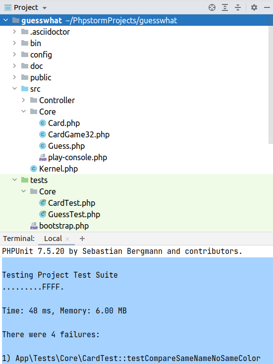

= Guess What

Prise en main de la POO avec PHP

Niveau : Deuxième année de BTS SIO SLAM

Prérequis : bases de la programmation, PHP 7 ou supérieur installé sur votre machine de dev.

== Thème 

Développer une logique de jeu en PHP en mettant en oeuvre de la conception objet et des tests unitaires.

Jeu en mode console. Un début d'implémentation est proposé (`play-console.php` à lancer dans une console)

TIP:  Ce projet est un bon candidat à une application web avec symfony, éligible comme activité professionnelle si prise en compte des scores des joueurs dans une base de données.

Les étapes d'un scénario typique d'usage sont 

1. (optionnel pour le joueur) paramétrage du jeu (par exemple choix du jeu de cartes, activation de l'aide à la recherche, ...)
2. Lancement d'une partie (le jeu instancie un jeu de carte et tire une carte "au hasard"), que le joueur doit deviner en un *temps optimal*
3. Le joueur propose une carte
4. Si ce n'est pas la bonne carte, alors si l'aide est activée, le joeur est informé si la carte qu'il a soumise est plus petite ou plus grande que celle à deviner. Retour en 3.
5. (c'est la bonne carte alors) La partie se termine et le jeu affiche des éléments d'analyse (nombre de fois où le joueur a soumis une carte, sa *qualité stratégique*, ...)
6. Fin de la partie.

== Objectif

* Conception et mise au point de la logique applicative avec PHPUnit
* Structure de données, recherche d'un élément dans une liste
* Analyse des actions du joueur (fonction du nombre de cartes, aides à la décision)  

== Premiers éléments d'analyse

[plantuml]
----
class Guess {
  withHelp : boolean

  start()
  isMatch(c : Card) : boolean
  getStatistic()
}

class CardGame32 {
  name
  {static} compare(Card c1, Card c2) : int
}

class Card {
  name
  color
}

Guess"*" -> "\nselectedCard  1  " Card : "                             "
Guess"*" -> "cardGame 1  " CardGame32 : "                                     "
CardGame32 "*" --> "   * cards  " Card : "                                     "
hide circle
----

Cette analyse est une première ébauche, donc incomplète et à ajuster, mais suffisante pour réaliser vos premiers pas sur ce projet. Qu'est-ce qu'elle nous dit ?

* Une instance de `Guess` est liée à une instance de `CardGame32` (un jeu de cartes) nommée `cardGame` et à une instance de `Card` nommée `selectedCard` (la carte à deviner)
* Une instance de `CardGame32` est liée à une collection (`array`) de cartes (instances de `Card`)

Pour l'essentiel (le cours associé apportera d'autres informations et répondra à vos questions) :

* La classe `Guess` est responsable de la logique du jeu.
* La classe `CardGame32` définit la structure d'un jeu de 32 cartes classique et ses méthodes.
* La classe `Card` définit la structure d'une carte à jouer et ses méthodes.

Une instance de `Guess` est reliée, à un instant _t_, à un jeu de cartes, lui-même reliè à un ensemble de cartes  (`cards`), et à une instance de `Card` (`selectedCard` est la carte que le joueur doit deviner)

== Première implémentation

Classe `Card` (extrait. Localisation : `src/Core/Card.php`)

[, php]
----
<?php
namespace App\Core;

/**
 * Class Card : Définition d'une carte à jouer
 * @package App\Core
 */
class Card
{
  /**
   * @var $name string nom de la carte, comme par exemples 'As' '2' 'Reine'
   */
  private $name;

  /**
   * @var $color string couleur de la carte, par exemples 'Pique', 'Carreau'
   */
  private $color; 

  /**
   * @return string
   */
  public function getName(): string
  {
    return $this->name;
  }

  // [...]
}
----

Classe `Guess` (incomplète. Localisation : `src/Core/Guess.php`)

[, php]
----
<?php

namespace App\Core;

/**
 * Class Guess : la logique du jeu.
 * @package App\Core
 */
class Guess
{
  /**
   * @var CardGame32 un jeu de cartes
   */
  private $cardGame;

  /**
   * @var Card c'est la carte à deviner par le joueur
   */
  private $selectedCard;

  /**
   * @var bool pour prendre en compte lors d'une partie
   */
  private $withHelp;
}
----

NOTE: L'usage de la syntaxe de documentation PHPDoc https://docs.phpdoc.org/3.0/guide/getting-started/what-is-a-docblock.html[DocBloc] est attendue dans votre code !

== Challenge-1 : Prise en main (4h à 8h)

=== Vérifier les prérequis de votre système

* `php cli`  doit être opérationnel. (en ligne de commande tester : `php -version`)
* `composer` doit être opérationnel. (en ligne de commande tester : `composer -V`)

=== Télécharger le projet de démarrage

TIP: Conseil : utiliser l'instruction `git clone` ou encore mieux, si vous êtes connecté à GiltLab avec votre compte,
faire directement, en ligne, un `fork` de ce projet ; vous pourrez ainsi directement cloner, sur votre machine de dev,
votre nouveau projet (et réaliser des `commit` et `push` de votre travail).

Une fois cloné, **aller à la racine du projet** puis lancer les commandes suivantes :

* `composer install`  (le téléchargement et installation des composants déclarés dans le fichier `composer.json` peut prendre quelques minutes)

* `./bin/phpunit --version` (le premier lancement de cette commande provoquera l'installation du plugin `phpunit`, puis lancera les tests.
  Le résultat devrait être, à un numéro de version prêt : `PHPUnit 7.5.20 by Sebastian Bergmann and contributors.` )

TIP: Sous windows la commande est `php .\bin\phpunit --version` (remarquez l'usage de `\` au lieu de `/` )

NOTE: À ce niveau là, ne vous préoccupez pas de l'écosystème Symfony, il serait étudié très bientôt.

=== Tester le bon fonctionnement de ce petit existant

==== Lancement des tests unitaires
  
À **la racine du projet** du projet, lancer la commande : `./bin/phpunit`

Le système lance alors l'exécution des tests unitaires du dossier `tests` du projet. 8 tests sont exécutés (100 % sans bug), dont 4 en échec (`FAILURE`) :

----
[racine du projet]$ ./bin/phpunit

Testing Project Test Suite
....FFFF.                                                    8 / 8 (100%)

Time: 48 ms, Memory: 6.00 MB

There were 4 failures:

1) App\Tests\Core\CardTest::testCompareSameNameNoSameColor
not implemented !

guesswhat/tests/Core/CardTest.php:65

2) App\Tests\Core\CardTest::testCompareNoSameCardNoSameColor
not implemented !

guesswhat/tests/Core/CardTest.php:71

3) App\Tests\Core\CardTest::testCompareNoSameCardSameColor
not implemented !

guesswhat/tests/Core/CardTest.php:77

4) App\Tests\Core\CardTest::testToString
not implemented !

guesswhat/tests/Core/CardTest.php:84

FAILURES!
Tests: 8, Assertions: 10, Failures: 4.
----

Cette commande à lancer 8 tests unitaires (8 fonctions) situés dans le dossier `tests`. Les tests vérifient le comportement de certains objets du projet (instances des classes `CardTest` et `GuessTest`)

Avant d'aller plus loin, vous devez étudier le concept de _test unitaire_ et prendre connaissance des bonnes pratiques de documentation du code.

Ressources à étudier :

* https://openclassrooms.com/fr/courses/4087056-testez-et-suivez-letat-de-votre-application-php/4419446-premiers-pas-avec-phpunit-et-les-tests-unitaires[Sur openclassrooms : premiers-pas-avec-phpunit-et-les-tests-unitaires] **à étudier - chez vous et/ou lors des séances de TP** - n'hésitez pas à noter vos questions, nous y répondrons en cours.
* https://phpunit.readthedocs.io/fr/latest/[Documentation de PHPUnit en français]

== Challenge-2 : Implémentation des TODOs de `CardTest` (~2H)

Bravo, si vous en êtes là, c'est que :

* Votre machine de dev est opérationnelle pour ce projet.
* Les concepts autour des test unitaires ne vous sont pas étranger.

Vous allez maintenant avoir besoin d'un éditeur de code source qui vous permette de passer en mode projet.

TIP: une *erreur de débutant* consiste à ouvrir un fichier à la fois à partir de son éditeur de code (IDE) au lieu d'ouvrir le dossier du projet.
 
Nous vous invitons à utiliser **PHPStorm** (un IDE très puissant en terme de conseils et de génération automatique de code).
 
Ouvrir le projet via `File | Open`, puis sélectionner le **dossier racine** de votre application.

Dans la fenêtre `Termnal` en bas, vous devriez pouvoir lancer la commande `./bin/phpunit` et obtenir ceci :

Le message `There were 4 failures` nous informe que 4 tests ont échoués.
**Ceci est votre premier challenge !**

Voici un extrait de la classe de test :

[, php]
----
<?php

namespace App\Tests\Core; <1>

use PHPUnit\Framework\TestCase;
use App\Core\Card;

class CardTest extends TestCase <2>
{

  public function testName() <3>
  {
    $card = new Card('As', 'Trèfle');  <4>
    $this->assertEquals('As', $card->getName()); <5>
  }

----
<1> Les classes de test sont placées, par convention, sur une arborescence `tests` (ou `test`) parallèle à `src`
<2> Cette classe de test hérite de `TestCase` (du framework `PHPUnit`)
<3> Attention, les méthodes de test commencent par le préfix _test_
<4> Création d'une instance de `Card` (As de trèfle)
<5> C'est ici que le test a lieu. `$this->assertEquals` (méthode héritée) permet de comparer
une *valeur attendue* (premier argument) avec une *valeur obtenue* par l'appel à la méthode `getName` de l'instance
précédemment créée (second argument). Le résultat dégagé suite à l'appel de `$this->assertEquals` est géré par `PHPUnit`
qui en fait l'analyse et la restitue en fin d'exécution des tests (exécution provoquée par la commande `./bin/phpunit`
dans le terminal)

Le travail à faire a été signalé dans le code source par des commentaires `TODO` (une pratique courante dans le métier).

 
WARNING: Attention : la méthode toString fait partie des méthodes dites "_magiques_" en PHP. À ce sujet vous consulterez
cette documentation https://www.php.net/manual/fr/language.oop5.magic.php#object.tostring[methode "magique" toString]

== Challenge-3 : Conception de tests unitaires pour `CardGame32` (~4H à 8h)
À ce niveau là, vous avez acquis une certaine autonomie sur le projet et intégré les concepts de base de la notion de tests unitaires. C'est ce que nous allons vérifier.

Comme son nom l'indique, la classe `CardGame32` représente un jeu de 32 cartes.

Travail à faire :

* Ajouter une nouvelle classe de test en respectant la logique de nommage utilisée dans ce projet.
* Concevoir des méthodes de test qui testent le bon comportement des objets (méthodes d'instance) de cette classe ainsi que ses méthodes statiques (méthodes de classe)

* Poursuivez la conception de la classe `CardGame32` : les TODO et au delà.

TIP: Pour consulter la liste des TODOs, ouvrir la fenêtre TODO tool: `View | Tool Windows | TODO`.

== Challenge-4 : Conception de tests unitaires pour `Guess` (~4h à 8h)

Votre mission consiste à concevoir une classe de tests qui teste la logique du jeu (représentée par la classe `Guess`).
Ce travail est à réaliser en binôme. Il y aura également des décisions à prendre, qui pourront être discutées collectivement, entre différents binômes.

Voici quelques éléments à prendre en compte dans votre analyse.

* *Recherche linéaire* (dite aussi séquentielle) : L'utilisateur explore une à une les cartes afin de trouver la bonne.
Dans le pire cas il soumettra autant de cartes que le jeu en contient (l'ordre de grandeur est O(n), _n_ étant 
le nombre de cartes), dans le meilleur cas O(1) (coup de chance il tombe dessus du premier coup).  
* *Recherche dichotomique* (nécessite une relation d'ordre total) : Si l'utilisateur est informé de la position de
la carte qu'il soumet par rapport à la carte à trouver (inférieur ou supérieur) alors il peut appliquer une 
stratégie qui réduit le nombre de cas à soumettre dans le pire cas, de l'ordre de O(log2 n). Wikipédia vous fournira
des informations utiles sur ces notions.

L'analyse de la stratégie du joueur, lorsqu'il termine une partie, devra prendre en compte les paramètres de la partie, à savoir le nombre de cartes et l'aide à la décision si elle a été activée pour la partie en question.

L'analyse de la stratégie du joueur peut être représentée sous la forme d'un texte (une chaine de caractères). C'est à vous de décider de son contenu (sa valeur).

TIP: Le travail demandé ne nécessite pas une interaction avec un utilisateur (un joueur), car tout se passe donc dans les classes de tests ! Vous pouvez cependant jouer avec votre programme en lançant, dans la console, la commande `php play-console.php` (se placer pour cela dans le dossier `src/Core`)

== Livraison

Modalité de livraison (mode « binôme ») : dépôt sur GitLab avec un *README.adoc* ou Github avec un *README.md*. Ce document présentera le travail que vous avez réalisé (TP1 à 4), ce sera votre *rapport de projet*. Il inclura un lien vers le dépôt initial _guesswhat_ (celui-ci) et un vers votre propre dépôt.

Ressources utiles : https://docs.gitlab.com/ee/user/asciidoc.html[courte documentation asciidoc sur GitLab], pour Github https://guides.github.com/features/mastering-markdown/

La deadline vous sera communiquée en milieu de semaine.

////
TIP: sous PhpStorm, vous pouvez extraire une version *PDF* de votre REAMDE.adoc (fonction dans la barre de menu d'édition du .adoc).
////

TIP: Pour le travail en binôme, sous PhpStorm, voir le concept (et outil) de _code with me_

Bonne analyse et programmation !
